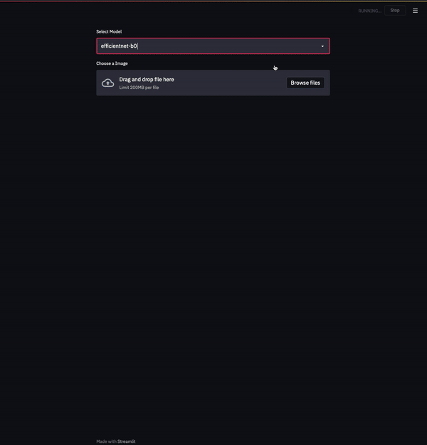
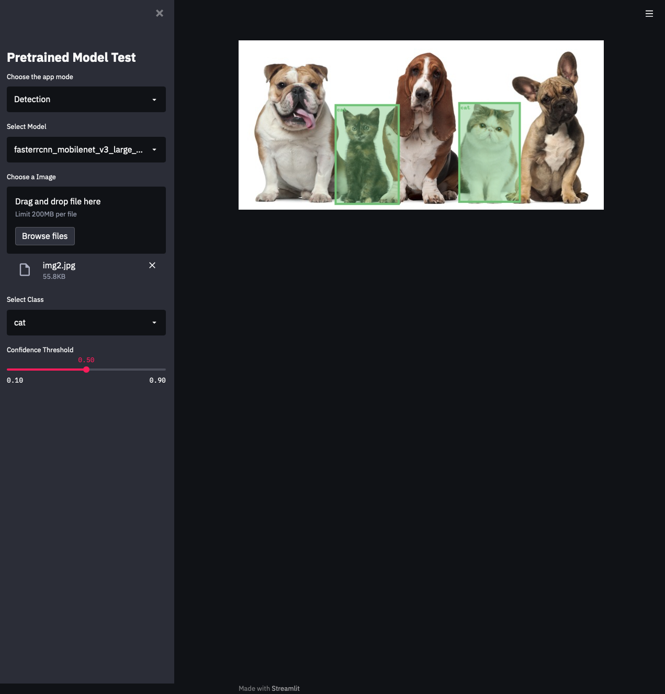

# Learning streamlit
- [Streamlit Cheat Sheet](https://share.streamlit.io/daniellewisdl/streamlit-cheat-sheet/app.py)
---

## Setup
``` bash
pip install Pillow streamlit torch torchvision pretrainedmodels efficientnet_pytorch
```

### Classification test page

- [02_classification_test.py](https://github.com/jjerry-k/learning_streamlit/02_classification_test.py) 실행 결과



### Pytorch Model Zoo

- [03_pytorch_model_zoo.py](https://github.com/jjerry-k/learning_streamlit/03_pytorch_model_zoo.py) 실행 결과

